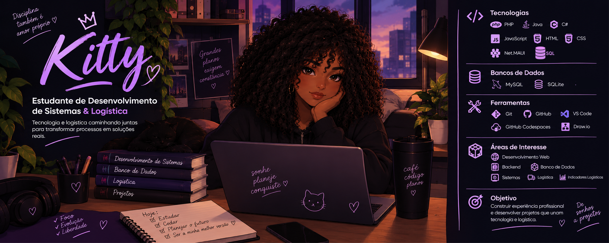

  

Sou estudante de Desenvolvimento de Sistemas e Logística.

Atualmente estou construindo minha experiência em desenvolvimento de software através de projetos próprios, trabalhos acadêmicos e experimentação prática.

Meu interesse principal está em entender como sistemas funcionam por trás da interface, especialmente a parte de backend, bancos de dados e lógica de negócio.

# O que estou construindo

Um dos meus projetos principais é um sistema de gestão logística, envolvendo controle de produtos, estoque, pedidos, clientes e entregas. A ideia é aplicar desenvolvimento de sistemas a uma área que também estudo profissionalmente: logística.

Também desenvolvo projetos acadêmicos relacionados a acessibilidade, indicadores logísticos e gerenciamento de informações.

# Minha stack

## Desenvolvimento

- PHP
- Java
- C#
- Net.MAUI
- JavaScript
- HTML
- CSS
- sql 

## Banco de Dados

- MySQL
- SQLite

## Ferramentas

- Git
- GitHub
- VS Code
- GitHub Codespaces
- Draw.io

<td width="50%" align="center">
  

  <h4>GitHub Stats</h4>

  
    

 
 
</td>

### 📊 Statistics

# No que estou focando

 Atualmente estou aprofundando meus conhecimentos em:

- Desenvolvimento backend
- Bancos de dados relacionais
- SQL
- Integração entre aplicação e banco de dados
- Estrutura e arquitetura de sistemas
- Desenvolvimento de aplicações voltadas a problemas reais

# Um pouco além do código

Também estudo Logística, então gosto particularmente de projetos em que tecnologia e processos se encontram.

É daí que vêm alguns dos meus projetos: em vez de pensar apenas em "o que consigo programar?", tento pensar em "qual problema esse sistema resolve?"

# Projetos

🔹 Easylog
Sistema de gestão logística desenvolvido para trabalhar com estoque, pedidos, clientes e entregas.

🔹 Dorina
Sistema de gerenciamento de atividades escolares com recursos voltados à acessibilidade.

🔹 Calculadora de Indicadores Logísticos
Aplicação para cálculo e acompanhamento de indicadores relacionados ao estoque.

# Atualmente

• Técnico em Desenvolvimento de Sistemas
•  Técnico em Logística
• Construindo projetos e estudando desenvolvimento de software
•  Buscando minha primeira oportunidade profissional na área
